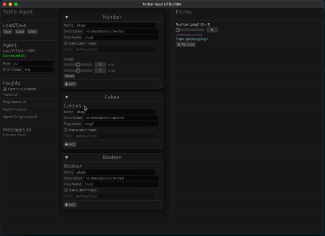

# Tether egui UI Builder

A tiny desktop app for remote-controlling Tether-controlled systems, simulating input, and more (soon). Built using the immediate-mode GUI library, [egui](https://www.egui.rs/).

## Launch with or without Tether Host
By default, Tether Egui will try to connect to an MQTT broker running at `tcp://localhost:1883`

Launch without Tether (build your UI only) by passing `--tether.disable`

Specify a different MQTT Broker, and optionally a username and password: `--tether.host 192.168.2.4 --tether.user username --tether.password passw0rd!`

More options: `--help`
## Widgets available
- Floating-point Number (64bit) 
- Whole Number (i64)
- Colour (8-bit for R,G,B,A)
- Boolean / Checkbox (e.g. for state)
- Empty Message (e.g for ping, heartbeat or representing an "event")
- Point2D (e.g. for tracking data)
- Generic Data (Parse string as JSON -> MessagePack)

## TODO
- [ ] Tether host can be saved in widgets.json, optionally overriden via CLI or GUI
- [ ] Add moving head light Widget (colour, orientation, brightness?)
- [ ] Should be able to adjust range on number values
- [x] All Widgets should have Send button as well as "send on change" functionality (and send-on-change should be optionally disabled for all?)
- [x] Add 2D point Widget
- [x] Should be able to edit Widgets after adding (not just remove and re-add)
- [x] Include sensible default descriptions per Widget type when adding
- [x] JSON validation should only apply to currently-edited widget
- [ ] Add 3D point Widget
- [x] Add "empty" Widget
- [x] Add editable "JSON string to MessagePack" Widget
- [ ] JSON editor should use egui syntax highlighting
- [x] Widgets render their own UI
- [x] Tether host can be specified in CLI
- [x] List plug names, agent IDs, roles as per "topics" cli
- [ ] Tether Agent on separate thread
- [ ] Stats (messages per second) for each topic
- [x] Allow saving/loading to custom file path (via GUI, dialog boxes) 

## Roadmap
- Add dashboard functionality (see which agents are online, monitor messages, etc.)
- Add simulate/playback built-in
- Integrate "tweaks" system