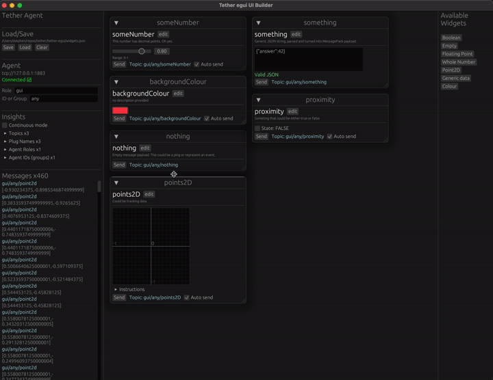

# Tether egui UI Builder

A tiny desktop app for remote-controlling Tether-controlled systems, simulating input, and more (soon).

## Widgets available
- Number (32-bit float only, for now) with range (not clamped)
- Colour (8-bit for R,G,B,A)
- Boolean / Checkbox

## TODO
- [ ] Tether host can be specified in CLI
- [ ] Tether host can be saved in widgets.json, optionally overriden via CLI or GUI
- [x] List plug names, agent IDs, roles as per "topics" cli
- [ ] Stats (messages per second) for each topic
- [ ] Allow saving/loading to custom file path (via GUI, dialog boxes) 

## Roadmap
- Add dashboard functionality (see which agents are online, monitor messages, etc.)
- Add simulate/playback built-in
- Integrate "tweaks" system